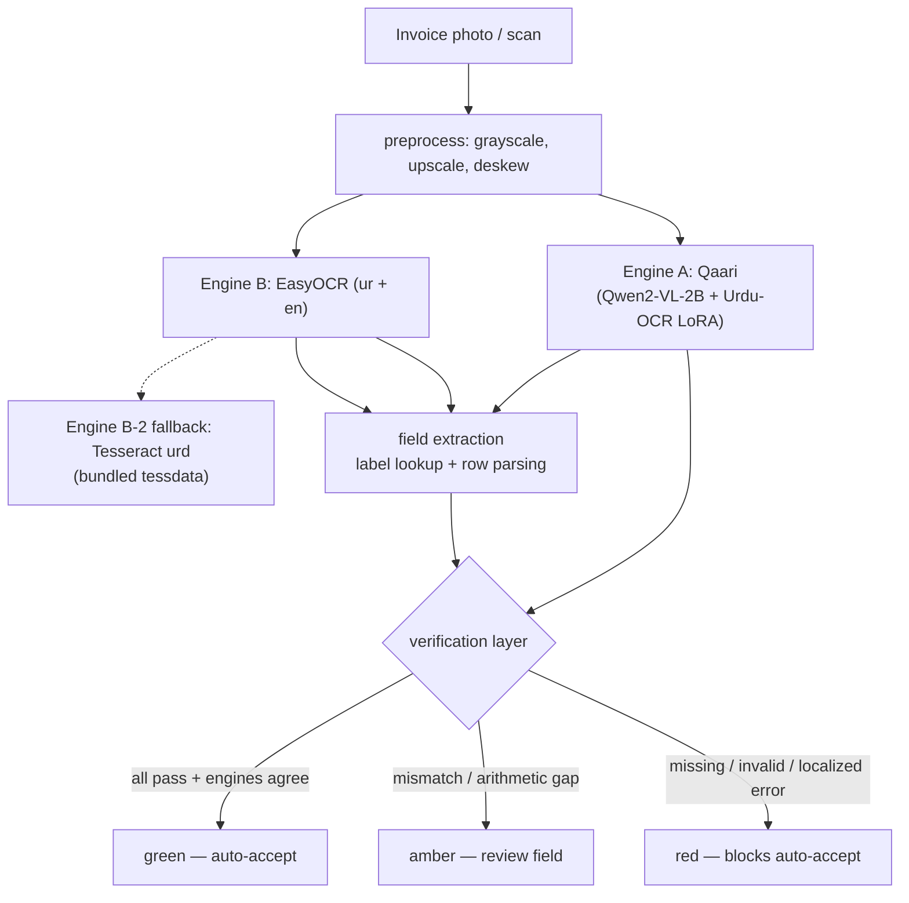

<div align="center">

# Tasdeeq

**Verified OCR for printed Urdu (Nastaliq) invoices**

*Two independent OCR engines read the invoice — a verification layer decides what to trust.*

[](https://huggingface.co/spaces/dayyan003/Tasdeeq)
[](https://dayyan-saeed.github.io/Tasdeeq/)
[](#testing)
[](LICENSE)
[](#quickstart)

</div>

---

## Why Tasdeeq

OCR on low-resource scripts fails *silently*: a number reads clean, looks
plausible, and is wrong. Tasdeeq (Urdu: تصدیق, "verification") is a research
demo built around one idea — **the deliverable is not the extracted text, it is
the confidence**. Every field comes back with a verdict:

| Verdict | Meaning |
|---|---|
| 🟢 **green** | All checks pass and both engines agree — safe to auto-accept |
| 🟡 **amber** | Arithmetic passes but engines disagree — a human must review |
| 🔴 **red** | Missing, invalid, or provably wrong — blocks auto-accept |

Nothing is ever auto-corrected. Wrong values are flagged, not patched.

**Highlights**

- **Dual-engine extraction** — Qaari (Qwen2-VL-2B + Urdu-OCR LoRA) and EasyOCR
  (ur + en), with a Tesseract fallback for CPU-only environments
- **Verification layer** — cent-precision arithmetic, cross-engine agreement,
  format validity, and single-digit error-localization *hints* (never mutations)
- **Reproducible benchmark** — 100-invoice synthetic Nastaliq dataset with
  ground truth, stratified clean / mild / heavy / corrupted
- **Honest evaluation** — held-out metrics per setup, latency measurements, and
  a documented verdict on where the GPU model helps and where it does not
- **Open demo** — Gradio app with login, editable results, and CSV/JSON export

## Live demo

- **Hugging Face Space** — <https://huggingface.co/spaces/dayyan003/Tasdeeq>
  (login `demo / tasdeeq123`; currently the static showcase while a GPU
  community grant is pending — the full Gradio app is already pushed)
- **Static showcase** with saved evaluation results —
  <https://dayyan-saeed.github.io/Tasdeeq/>

## How it works



- **Engine A** — [`oddadmix/Qaari-0.1-Urdu-OCR-VL-2B-Instruct`](https://huggingface.co/oddadmix/Qaari-0.1-Urdu-OCR-VL-2B-Instruct)
  (LoRA on `Qwen/Qwen2-VL-2B-Instruct`), fp16 on GPU / fp32 on CPU.
- **Engines behind one interface** (`tasdeeq/engines/base.py:OCREngine`) — the
  fallback is a registry swap: `get_engine("tesseract")`.
- **Verification** — arithmetic at cent precision, engine agreement (exact on
  numbers, normalized edit distance on text), date / negative / shape validity,
  and error-localization hints that never mutate values.

## Results

Main set is synthetic (100 rendered invoices, seed 42; 80 dev / 20 held-out).
Held-out numbers from `results/results.md` (GPU T4 raw cache re-scored with the
current extraction code):

| setup | field acc (num/date/total) | verifier acc | green precision | flag rate on wrong | corrupted recall |
|---|---|---|---|---|---|
| Qaari alone | 35% / 50% / 15% | 74% | 0.545 | 0.789 | 1.0 |
| EasyOCR alone | 40% / 55% / 25% | 78% | 0.673 | 0.738 | 1.0 |
| Tesseract alone | 40% / 40% / 0% | 93% | 0.941 | 0.987 | 1.0 |
| **Pipeline (Qaari + EasyOCR)** | 35% / 50% / 35% | 78% | **1.0** | **1.0** | **1.0** |
| Pipeline (EasyOCR + Tesseract) | 40% / 60% / 25% | 74% | 1.0 | 1.0 | 1.0 |

Latency: Qaari **77 s**/invoice (T4) vs EasyOCR 2.1 s, Tesseract 1.6 s.

### Is Qaari usable, or should we switch to the fallback?

**Qaari is usable — but only as an agreement engine inside the pipeline.**

- **Not standalone.** On full-page table invoices 16/20 raw outputs degenerate
  into repetition loops before the totals section (totals extracted: 1/20
  pre-fix, 3/20 after `repetition_penalty=1.05` + `max_new_tokens=2000`); the
  model card's WER claims were measured on text lines, not table layouts. It
  also costs 40× the CPU engines' latency.
- **Yes in the pipeline.** Qaari + EasyOCR meets every safety target: green
  precision 1.0, flag-rate-on-wrong 1.0, corrupted recall 1.0 — 16 fields
  auto-accepted with zero wrong greens.
- **No forced switch.** The GPU-free alternative (EasyOCR + Tesseract) ties on
  all three safety metrics (16 vs 14 greens, verifier 78% vs 74%), so Tesseract
  remains the no-GPU fallback the app selects when CUDA is absent. Qaari's weak
  standalone quality means it can only ever vote, never lead.

**Known limitations**

- The main evaluation set is synthetic; real-photo evaluation awaits real
  printed invoices.
- Field extraction is partial (35% exact / 50% partial / 35% missing) — trust
  the verdicts, verify values against the invoice.
- The demo is for research and education. Do not auto-accept financial
  documents without human review.

## Quickstart (local, CPU)

```bash
pip install -r requirements.txt
python -m pytest tests -q                  # 45 tests
python -m tasdeeq.synth.generate --n 100 --seed 42   # regenerate dataset (already shipped)
python -m eval.run_eval                     # CPU setups -> results/results.md
python app.py                               # demo UI (EasyOCR + Tesseract)
```

Tesseract needs the `tesseract` binary (bundled
`tasdeeq/engines/tessdata/` supplies the Urdu + English language data; on
Windows install [UB-Mannheim.TesseractOCR](https://github.com/UB-Mannheim/tesseract/wiki)).

## GPU evaluation (Qaari) — Colab

The 2B model does not run well on CPU. Use the notebook:

1. Open `notebooks/tasdeeq_eval.ipynb` in Google Colab (free T4 is enough).
2. `Runtime → Change runtime type → T4 GPU`.
3. Run all; when prompted, upload `tasdeeq_colab.zip` (build it with
   `python tools/build_colab_zip.py`).
4. It scores the three setups on the 20 held-out invoices and downloads
   `results.md`, `results.json`, `raw_cache.json` — drop them into
   `results/`; `python -m eval.run_eval --engines qaari,easyocr,tesseract`
   re-scores them offline.

## Dataset

`synth/out/` — 100 synthetic invoices (seed 42): 80 dev / 20 held-out eval,
stratified clean / mild / heavy / corrupted. Ground truth includes a
**corrupted** variant where the printed total digit is wrong while the true
total stays in `ground_truth.json` — the verifier's error-recall target.
Regenerate or extend with `python -m tasdeeq.synth.generate --n <n> --seed <s>`.

## Repository layout

```
tasdeeq/
  schema.py         # Invoice, LineItem, OCRResult, FieldVerdict
  normalize.py      # digit/punct/yeh canonicalization, parse_amount/date
  extract.py        # label lookup + direction-agnostic row parsing
  verify.py         # verification layer (the product edge)
  preprocess.py     # deskew + upscale
  engines/          # OCREngine base, qaari, easyocr, tesseract (+ tessdata)
  synth/generate.py # Nastaliq renderer (uharfbuzz+freetype) + stratified dataset
tests/              # 45 unit tests
eval/run_eval.py    # held-out evaluation (writes results/)
results/            # measured results, raw OCR cache, baselines
synth/out/          # 100-invoice dataset with ground truth
app.py              # Gradio demo (login, editable table, CSV/JSON export)
notebooks/          # Colab GPU evaluation
docs/               # static showcase (GitHub Pages)
space/              # Hugging Face Space frontmatter + requirements
tools/              # build scripts: Colab zip, Space staging, Pages site
```

## Testing

```bash
python -m pytest tests -q     # 45 passed
```

## Deployment

- **HF Space** — static holding page live; flips to Gradio + ZeroGPU after the
  GPU community grant is approved (procedure in `DEPLOY.md`).
- **GitHub Pages** — static showcase live at
  <https://dayyan-saeed.github.io/Tasdeeq/>.

## Disclaimer

Tasdeeq is a research and educational project. Verdicts are measured on a
synthetic benchmark; no warranty of accuracy is provided. Do not use it to
auto-accept financial or legal documents.

## License

[MIT](LICENSE)
